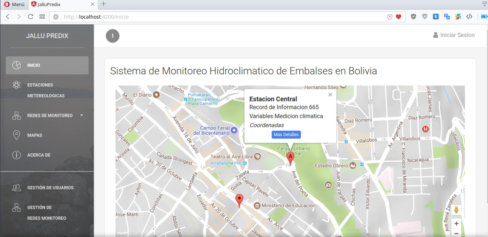
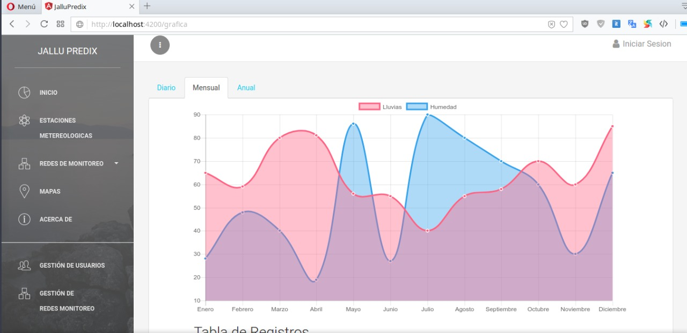
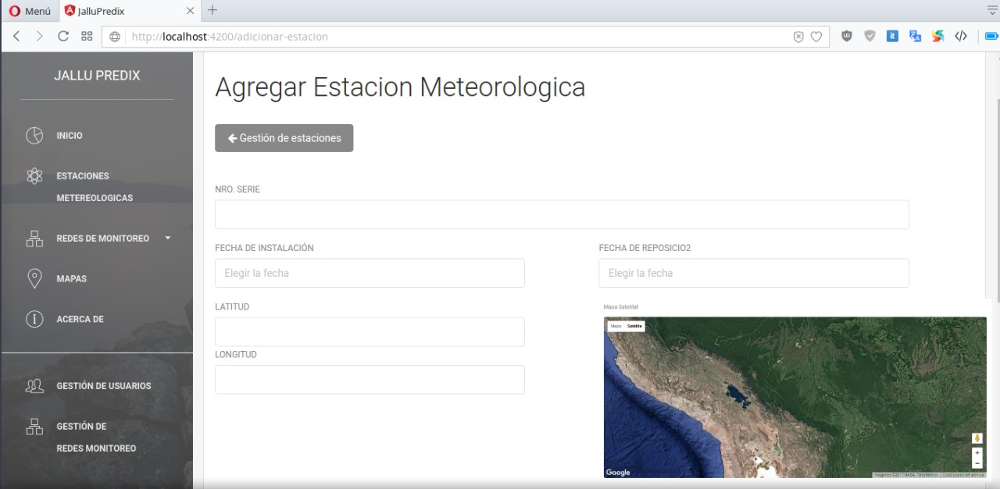

# JalluPredix: Automatic system for real-time rainfall monitoring and prediction in Bolivia
## **Overview**
JalluPredix is an automatic system for real-time rainfall monitoring and prediction in Bolivia. It consists of two main parts: 

*   An IoT rain gauge built with Arduino and 3D printing
*   A webapp developed with MeanJS.

Since the device was initially meant to work in remote Bolivian towns and villages, the device has a GSM/GPRS component that sends the data every 24 hours. This collected data is processed with Python, Pandas, and Scikit-learn to make predictions using the ARIMA model for every weather station. 

Data from public rain gauges takes an important role as the project aims to provide accurate predictions correlating data from different sources. 

## **Dependencies**

### <ins> WebAPP </ins>
- MongoDB
- Angular CLI 1.2
- Express
- NodeJS

### <ins> Machine Learning </ins>
- Python 3
- Jupyter Notebook
- Pandas
- Numpy
- Matplotlib
- Selenium

## **Installation**

Once installed the dependencies, run the following command: 
`npm install`

Continue runing `ng serve` for a dev server. Navigate to `http://localhost:4200/`. The app will automatically reload if you change any of the source files.

## **Licence**

The MIT License

Copyright (c) 2020 Edwin Salcedo

Permission is hereby granted, free of charge, to any person obtaining a copy
of this software and associated documentation files (the "Software"), to deal
in the Software without restriction, including without limitation the rights
to use, copy, modify, merge, publish, distribute, sublicense, and/or sell
copies of the Software, and to permit persons to whom the Software is
furnished to do so.